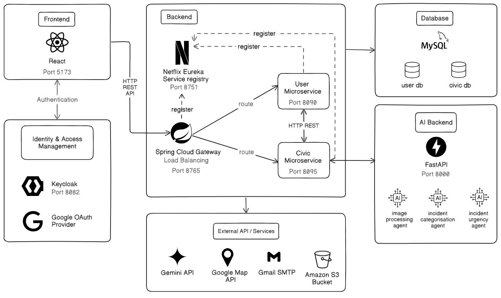

# Aynak — Civic Reporting Platform
Aynak is web application for reporting civic issues in the UAE. It lets citizens report issues such as street garbage, broken lights, injured/dead animal on the street. It enables residents to report issues using AI-powered image recognition. It then tracks the reported issues through a review workflow with local authorities, and rewards civic participation through a points/voucher system sponsored by local businesses.


## System Architecture

<p align="center">

</p> 
  
The system follows a microservice architecture consisting of:
- **API Gateway** – Routes client requests to the appropriate microservices. It only routes requests, each microservice independently validates the JWT against Keycloak.
- **Service Registry (Eureka)** – Provides service discovery where initially services register themselves with Eureka so the gateway and services can find each other without hardcoded URLs.
- **User Service** – Manages authentication, authorization, and user profiles.
- **Civic Service** – Handles reports, rewards, AI processing, and notifications.

 **Note:** This diagram shows the target/full architecture for the project. The code in this repository is not the final version —
  it does not yet include the FastAPI AI Backend (image processing, incident categorisation, and incident urgency agents).
  AI-assisted report analysis in this version is handled directly by civic-service calling the Gemini API.
  

## Tech Stack

**Backend**
- Spring Boot 4.0.6, Java 21, Spring Cloud 2025.1.1
- Spring Cloud Gateway (WebMVC), Netflix Eureka, OpenFeign
- Spring Security OAuth2 Resource Server (JWT validation against Keycloak)

**Frontend**
- React 19, Vite 8, React Router 7
- `keycloak-js` — OIDC/PKCE authentication
- Mapbox GL — Map for report locations
- Recharts — analytics dashboards

**Identity & Infra**
- Keycloak (realm-based OIDC provider, role-based access, Google login)
- MySQL 8
- Docker (Keycloak container)


## Prerequisites
- Java 21
- Node.js 18+ and npm
- MySQL 8 running locally on port `3306`
- Docker Desktop (for Keycloak)
- A Google Gemini API key
- A Mapbox access token
- A Gmail account with an **App Password** generated

## Setup & Run Guide

### 1. Create the MySQL databases

```sql
CREATE DATABASE user2_db;
CREATE DATABASE civic2_db;
```

Tables are created automatically on first run.

### 2. Start Keycloak in Docker

```bash
docker volume create keycloak2_data

docker run -d ^
  --name keycloakcontain2 ^
  -p 8082:8080 ^
  -v keycloak2_data:/opt/keycloak/data ^
  -e KEYCLOAK_ADMIN=your_admin_username ^
  -e KEYCLOAK_ADMIN_PASSWORD=your_admin_password ^
  quay.io/keycloak/keycloak:latest ^
  start-dev
```

> The `^` line continuations are for Windows CMD. On macOS/Linux, replace `^` with `\`.


### 3. Import the realm

1. Open `http://localhost:8082` and log in with the admin credentials above.
2. Click the realm dropdown (top-left) → **Create Realm**.
3. Click **Browse**, select `keycloak/realm-export-aynak.json` from this repo, then **Create**.
4. Keycloak strips secrets on export, so re-enter these manually after import:
   - **Identity Providers → google → Client Secret** — your Google OAuth client secret (only needed for "Sign in with Google")
   - **Realm Settings → Email → Password** — your Gmail App Password (only needed for Keycloak's own emails)

### 4. Configure and run the backend services

Set the required environment variables (Windows CMD example):

```bash
set DATABASE_PASSWORD=your_mysql_root_password
set GEMINI_API_KEY=your_gemini_api_key
set GMAIL_APP_PASSWORD=your_gmail_app_password
```

Start each service **in this order**, each in its own terminal, from its own folder:

```bash
cd backend/service-registry
mvnw.cmd spring-boot:run
```
```bash
cd backend/user-service
mvnw.cmd spring-boot:run
```
```bash
cd backend/civic-service
mvnw.cmd spring-boot:run
```
```bash
cd backend/api-gateway
mvnw.cmd spring-boot:run
```

(On macOS/Linux use `./mvnw spring-boot:run`.)

Wait for `service-registry` (port `8761`) to be up before starting the others.

### 5. Run the frontend

```bash
cd frontend
npm install
```

Create a `.env` file inside `frontend/`:

```env
VITE_MAPBOX_TOKEN=your_mapbox_public_token
VITE_KEYCLOAK_URL=http://localhost:8082
VITE_KEYCLOAK_REALM=aynak
VITE_KEYCLOAK_CLIENT_ID=aynak-spa
VITE_API_BASE_URL=http://localhost:8765
```

```bash
npm run dev
```

Open `http://localhost:5173`.

> The API Gateway's CORS config only allows `http://localhost:5173` as an origin. If you run the frontend on a different port, update `CorsConfig.java` in `api-gateway`.

## Environment Variables

| Variable | Used by | Description |
|---|---|---|
| `DATABASE_PASSWORD` | user-service, civic-service | MySQL `root` password |
| `GEMINI_API_KEY` | civic-service | Google Gemini API key for AI report analysis |
| `GMAIL_APP_PASSWORD` | civic-service | Gmail App Password for email notifications |
| `VITE_MAPBOX_TOKEN` | frontend | Mapbox public access token |
| `VITE_KEYCLOAK_URL` | frontend | Keycloak base URL (`http://localhost:8082`) |
| `VITE_KEYCLOAK_REALM` | frontend | Keycloak realm (`aynak`) |
| `VITE_KEYCLOAK_CLIENT_ID` | frontend | Keycloak SPA client (`aynak-spa`) |
| `VITE_API_BASE_URL` | frontend | API Gateway URL (`http://localhost:8765`) |
